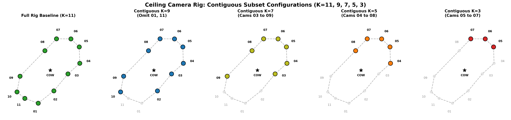

# Ablation: K Contiguous

This section documents the ablation studies for this group.

### Overall Results Plot

## ablation_k3_contiguous_frame125
- **Path**: `cow-2026-07-29/ablation_k3_contiguous_frame125`
- **Objective**: Test performance for configuration `ablation_k3_contiguous_frame125`.

### Results Summary
- **Reconstructed Points**: 88,699
- **Bounding Box X**: -0.1187 to 1.9923

## ablation_k3_contiguous_frame1940
- **Path**: `cow-2026-07-29/ablation_k3_contiguous_frame1940`
- **Objective**: Test performance for configuration `ablation_k3_contiguous_frame1940`.

### Results Summary
- **Reconstructed Points**: 4,999
- **Bounding Box X**: -0.0261 to 1.7344

## ablation_k3_contiguous_frame1980
- **Path**: `cow-2026-07-29/ablation_k3_contiguous_frame1980`
- **Objective**: Test performance for configuration `ablation_k3_contiguous_frame1980`.

### Results Summary
- **Reconstructed Points**: 6,138
- **Bounding Box X**: -0.0226 to 1.9211

## ablation_k3_contiguous_frame200
- **Path**: `cow-2026-07-29/ablation_k3_contiguous_frame200`
- **Objective**: Test performance for configuration `ablation_k3_contiguous_frame200`.

### Results Summary
- **Reconstructed Points**: 126,908
- **Bounding Box X**: 0.0169 to 1.7259

## ablation_k5_contiguous_frame125
- **Path**: `cow-2026-07-29/ablation_k5_contiguous_frame125`
- **Objective**: Test performance for configuration `ablation_k5_contiguous_frame125`.

### Results Summary
- **Reconstructed Points**: 154,039
- **Bounding Box X**: -3.0463 to 1.7030

## ablation_k5_contiguous_frame1940
- **Path**: `cow-2026-07-29/ablation_k5_contiguous_frame1940`
- **Objective**: Test performance for configuration `ablation_k5_contiguous_frame1940`.

### Results Summary
- **Reconstructed Points**: 65,265
- **Bounding Box X**: -2.9396 to 1.7404

## ablation_k5_contiguous_frame1980
- **Path**: `cow-2026-07-29/ablation_k5_contiguous_frame1980`
- **Objective**: Test performance for configuration `ablation_k5_contiguous_frame1980`.

### Results Summary
- **Reconstructed Points**: 90,991
- **Bounding Box X**: -2.7803 to 1.8730

## ablation_k5_contiguous_frame200
- **Path**: `cow-2026-07-29/ablation_k5_contiguous_frame200`
- **Objective**: Test performance for configuration `ablation_k5_contiguous_frame200`.

### Results Summary
- **Reconstructed Points**: 246,515
- **Bounding Box X**: -2.9047 to 1.7178

## ablation_k7_contiguous_frame125
- **Path**: `cow-2026-07-29/ablation_k7_contiguous_frame125`
- **Objective**: Test performance for configuration `ablation_k7_contiguous_frame125`.

### Results Summary
- **Reconstructed Points**: 179,704
- **Bounding Box X**: -3.2414 to 2.8663

## ablation_k7_contiguous_frame1940
- **Path**: `cow-2026-07-29/ablation_k7_contiguous_frame1940`
- **Objective**: Test performance for configuration `ablation_k7_contiguous_frame1940`.

### Results Summary
- **Reconstructed Points**: 89,662
- **Bounding Box X**: -2.9433 to 3.0943

## ablation_k7_contiguous_frame1980
- **Path**: `cow-2026-07-29/ablation_k7_contiguous_frame1980`
- **Objective**: Test performance for configuration `ablation_k7_contiguous_frame1980`.

### Results Summary
- **Reconstructed Points**: 129,024
- **Bounding Box X**: -2.7637 to 2.8681

## ablation_k7_contiguous_frame200
- **Path**: `cow-2026-07-29/ablation_k7_contiguous_frame200`
- **Objective**: Test performance for configuration `ablation_k7_contiguous_frame200`.

### Results Summary
- **Reconstructed Points**: 271,173
- **Bounding Box X**: -2.9039 to 2.8247

## ablation_k9_contiguous_frame125
- **Path**: `cow-2026-07-29/ablation_k9_contiguous_frame125`
- **Objective**: Test performance for configuration `ablation_k9_contiguous_frame125`.

### Results Summary
- **Reconstructed Points**: 268,368
- **Bounding Box X**: -3.1196 to 2.7995

## ablation_k9_contiguous_frame1940
- **Path**: `cow-2026-07-29/ablation_k9_contiguous_frame1940`
- **Objective**: Test performance for configuration `ablation_k9_contiguous_frame1940`.

### Results Summary
- **Reconstructed Points**: 106,390
- **Bounding Box X**: -3.2335 to 2.9656

## ablation_k9_contiguous_frame1980
- **Path**: `cow-2026-07-29/ablation_k9_contiguous_frame1980`
- **Objective**: Test performance for configuration `ablation_k9_contiguous_frame1980`.

### Results Summary
- **Reconstructed Points**: 163,967
- **Bounding Box X**: -2.7742 to 2.8486

## ablation_k9_contiguous_frame200
- **Path**: `cow-2026-07-29/ablation_k9_contiguous_frame200`
- **Objective**: Test performance for configuration `ablation_k9_contiguous_frame200`.

### Results Summary
- **Reconstructed Points**: 269,149
- **Bounding Box X**: -3.4772 to 2.9655

