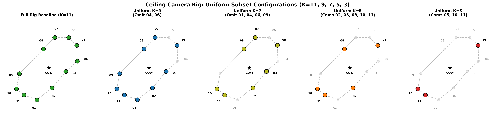

# Ablation: K Uniform

This section documents the ablation studies for this group.

### Overall Results Plot

## ablation_k3_uniform_frame125
- **Path**: `cow-2026-07-29/ablation_k3_uniform_frame125`
- **Objective**: Test performance for configuration `ablation_k3_uniform_frame125`.

### Results Summary
*(Results to be populated from logs)*

## ablation_k3_uniform_frame1940
- **Path**: `cow-2026-07-29/ablation_k3_uniform_frame1940`
- **Objective**: Test performance for configuration `ablation_k3_uniform_frame1940`.

### Results Summary
*(Results to be populated from logs)*

## ablation_k3_uniform_frame1980
- **Path**: `cow-2026-07-29/ablation_k3_uniform_frame1980`
- **Objective**: Test performance for configuration `ablation_k3_uniform_frame1980`.

### Results Summary
*(Results to be populated from logs)*

## ablation_k3_uniform_frame200
- **Path**: `cow-2026-07-29/ablation_k3_uniform_frame200`
- **Objective**: Test performance for configuration `ablation_k3_uniform_frame200`.

### Results Summary
*(Results to be populated from logs)*

## ablation_k5_uniform_frame125
- **Path**: `cow-2026-07-29/ablation_k5_uniform_frame125`
- **Objective**: Test performance for configuration `ablation_k5_uniform_frame125`.

### Results Summary
*(Results to be populated from logs)*

## ablation_k5_uniform_frame1940
- **Path**: `cow-2026-07-29/ablation_k5_uniform_frame1940`
- **Objective**: Test performance for configuration `ablation_k5_uniform_frame1940`.

### Results Summary
*(Results to be populated from logs)*

## ablation_k5_uniform_frame1980
- **Path**: `cow-2026-07-29/ablation_k5_uniform_frame1980`
- **Objective**: Test performance for configuration `ablation_k5_uniform_frame1980`.

### Results Summary
*(Results to be populated from logs)*

## ablation_k5_uniform_frame200
- **Path**: `cow-2026-07-29/ablation_k5_uniform_frame200`
- **Objective**: Test performance for configuration `ablation_k5_uniform_frame200`.

### Results Summary
*(Results to be populated from logs)*

## ablation_k7_uniform_frame125
- **Path**: `cow-2026-07-29/ablation_k7_uniform_frame125`
- **Objective**: Test performance for configuration `ablation_k7_uniform_frame125`.

### Results Summary
*(Results to be populated from logs)*

## ablation_k7_uniform_frame1940
- **Path**: `cow-2026-07-29/ablation_k7_uniform_frame1940`
- **Objective**: Test performance for configuration `ablation_k7_uniform_frame1940`.

### Results Summary
*(Results to be populated from logs)*

## ablation_k7_uniform_frame1980
- **Path**: `cow-2026-07-29/ablation_k7_uniform_frame1980`
- **Objective**: Test performance for configuration `ablation_k7_uniform_frame1980`.

### Results Summary
*(Results to be populated from logs)*

## ablation_k7_uniform_frame200
- **Path**: `cow-2026-07-29/ablation_k7_uniform_frame200`
- **Objective**: Test performance for configuration `ablation_k7_uniform_frame200`.

### Results Summary
*(Results to be populated from logs)*

## ablation_k9_uniform_frame125
- **Path**: `cow-2026-07-29/ablation_k9_uniform_frame125`
- **Objective**: Test performance for configuration `ablation_k9_uniform_frame125`.

### Results Summary
*(Results to be populated from logs)*

## ablation_k9_uniform_frame1940
- **Path**: `cow-2026-07-29/ablation_k9_uniform_frame1940`
- **Objective**: Test performance for configuration `ablation_k9_uniform_frame1940`.

### Results Summary
*(Results to be populated from logs)*

## ablation_k9_uniform_frame1980
- **Path**: `cow-2026-07-29/ablation_k9_uniform_frame1980`
- **Objective**: Test performance for configuration `ablation_k9_uniform_frame1980`.

### Results Summary
*(Results to be populated from logs)*

## ablation_k9_uniform_frame200
- **Path**: `cow-2026-07-29/ablation_k9_uniform_frame200`
- **Objective**: Test performance for configuration `ablation_k9_uniform_frame200`.

### Results Summary
*(Results to be populated from logs)*

