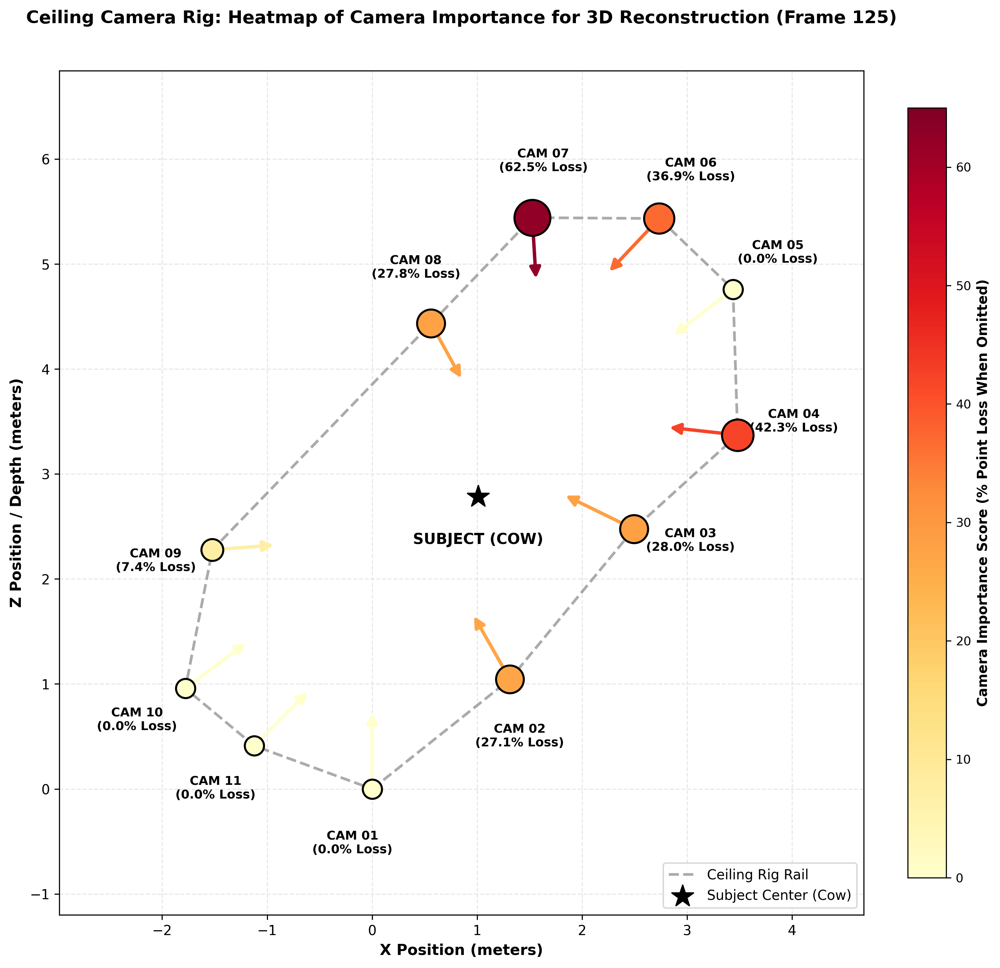

# Ablation: Omit Camera

This section documents the ablation studies for this group.

### Overall Results Plot

## ablation_omit_cam01_frame125
- **Path**: `cow-2026-07-29/ablation_omit_cam01_frame125`
- **Objective**: Test performance for configuration `ablation_omit_cam01_frame125`.

### Results Summary
- **Reconstructed Points**: 266,424
- **Bounding Box X**: -3.0389 to 4.1602

## ablation_omit_cam01_frame1940
- **Path**: `cow-2026-07-29/ablation_omit_cam01_frame1940`
- **Objective**: Test performance for configuration `ablation_omit_cam01_frame1940`.

### Results Summary
- **Reconstructed Points**: 105,727
- **Bounding Box X**: -3.5985 to 5.2641

## ablation_omit_cam01_frame1980
- **Path**: `cow-2026-07-29/ablation_omit_cam01_frame1980`
- **Objective**: Test performance for configuration `ablation_omit_cam01_frame1980`.

### Results Summary
- **Reconstructed Points**: 159,446
- **Bounding Box X**: -2.8497 to 3.3315

## ablation_omit_cam02_frame125
- **Path**: `cow-2026-07-29/ablation_omit_cam02_frame125`
- **Objective**: Test performance for configuration `ablation_omit_cam02_frame125`.

### Results Summary
- **Reconstructed Points**: 180,730
- **Bounding Box X**: -3.0372 to 3.7506

## ablation_omit_cam02_frame1940
- **Path**: `cow-2026-07-29/ablation_omit_cam02_frame1940`
- **Objective**: Test performance for configuration `ablation_omit_cam02_frame1940`.

### Results Summary
- **Reconstructed Points**: 93,686
- **Bounding Box X**: -2.4422 to 5.2649

## ablation_omit_cam02_frame1980
- **Path**: `cow-2026-07-29/ablation_omit_cam02_frame1980`
- **Objective**: Test performance for configuration `ablation_omit_cam02_frame1980`.

### Results Summary
- **Reconstructed Points**: 134,847
- **Bounding Box X**: -2.6976 to 3.1648

## ablation_omit_cam03_frame125
- **Path**: `cow-2026-07-29/ablation_omit_cam03_frame125`
- **Objective**: Test performance for configuration `ablation_omit_cam03_frame125`.

### Results Summary
- **Reconstructed Points**: 178,485
- **Bounding Box X**: -2.9590 to 3.9741

## ablation_omit_cam03_frame1940
- **Path**: `cow-2026-07-29/ablation_omit_cam03_frame1940`
- **Objective**: Test performance for configuration `ablation_omit_cam03_frame1940`.

### Results Summary
- **Reconstructed Points**: 83,465
- **Bounding Box X**: -2.6010 to 5.2576

## ablation_omit_cam03_frame1980
- **Path**: `cow-2026-07-29/ablation_omit_cam03_frame1980`
- **Objective**: Test performance for configuration `ablation_omit_cam03_frame1980`.

### Results Summary
- **Reconstructed Points**: 96,202
- **Bounding Box X**: -2.9388 to 3.1569

## ablation_omit_cam04_frame125
- **Path**: `cow-2026-07-29/ablation_omit_cam04_frame125`
- **Objective**: Test performance for configuration `ablation_omit_cam04_frame125`.

### Results Summary
- **Reconstructed Points**: 143,172
- **Bounding Box X**: -1.7083 to 4.7558

## ablation_omit_cam04_frame1940
- **Path**: `cow-2026-07-29/ablation_omit_cam04_frame1940`
- **Objective**: Test performance for configuration `ablation_omit_cam04_frame1940`.

### Results Summary
- **Reconstructed Points**: 37,924
- **Bounding Box X**: -1.4192 to 3.2240

## ablation_omit_cam04_frame1980
- **Path**: `cow-2026-07-29/ablation_omit_cam04_frame1980`
- **Objective**: Test performance for configuration `ablation_omit_cam04_frame1980`.

### Results Summary
- **Reconstructed Points**: 73,639
- **Bounding Box X**: -1.6789 to 3.1499

## ablation_omit_cam05_frame125
- **Path**: `cow-2026-07-29/ablation_omit_cam05_frame125`
- **Objective**: Test performance for configuration `ablation_omit_cam05_frame125`.

### Results Summary
- **Reconstructed Points**: 288,645
- **Bounding Box X**: -2.8076 to 4.7558

## ablation_omit_cam05_frame1940
- **Path**: `cow-2026-07-29/ablation_omit_cam05_frame1940`
- **Objective**: Test performance for configuration `ablation_omit_cam05_frame1940`.

### Results Summary
- **Reconstructed Points**: 183,455
- **Bounding Box X**: -3.1954 to 3.9323

## ablation_omit_cam05_frame1980
- **Path**: `cow-2026-07-29/ablation_omit_cam05_frame1980`
- **Objective**: Test performance for configuration `ablation_omit_cam05_frame1980`.

### Results Summary
- **Reconstructed Points**: 165,459
- **Bounding Box X**: -2.3032 to 3.1494

## ablation_omit_cam06_frame125
- **Path**: `cow-2026-07-29/ablation_omit_cam06_frame125`
- **Objective**: Test performance for configuration `ablation_omit_cam06_frame125`.

### Results Summary
- **Reconstructed Points**: 156,431
- **Bounding Box X**: -2.7519 to 4.7599

## ablation_omit_cam06_frame1940
- **Path**: `cow-2026-07-29/ablation_omit_cam06_frame1940`
- **Objective**: Test performance for configuration `ablation_omit_cam06_frame1940`.

### Results Summary
- **Reconstructed Points**: 84,062
- **Bounding Box X**: -3.5003 to 3.2234

## ablation_omit_cam06_frame1980
- **Path**: `cow-2026-07-29/ablation_omit_cam06_frame1980`
- **Objective**: Test performance for configuration `ablation_omit_cam06_frame1980`.

### Results Summary
- **Reconstructed Points**: 105,420
- **Bounding Box X**: -3.4983 to 3.1486

## ablation_omit_cam07_frame125
- **Path**: `cow-2026-07-29/ablation_omit_cam07_frame125`
- **Objective**: Test performance for configuration `ablation_omit_cam07_frame125`.

### Results Summary
- **Reconstructed Points**: 92,909
- **Bounding Box X**: -3.0489 to 4.7550

## ablation_omit_cam07_frame1940
- **Path**: `cow-2026-07-29/ablation_omit_cam07_frame1940`
- **Objective**: Test performance for configuration `ablation_omit_cam07_frame1940`.

### Results Summary
- **Reconstructed Points**: 58,485
- **Bounding Box X**: -3.4692 to 3.2234

## ablation_omit_cam07_frame1980
- **Path**: `cow-2026-07-29/ablation_omit_cam07_frame1980`
- **Objective**: Test performance for configuration `ablation_omit_cam07_frame1980`.

### Results Summary
- **Reconstructed Points**: 66,018
- **Bounding Box X**: -3.4580 to 3.1478

## ablation_omit_cam08_frame125
- **Path**: `cow-2026-07-29/ablation_omit_cam08_frame125`
- **Objective**: Test performance for configuration `ablation_omit_cam08_frame125`.

### Results Summary
- **Reconstructed Points**: 179,012
- **Bounding Box X**: -2.7782 to 3.7595

## ablation_omit_cam08_frame1940
- **Path**: `cow-2026-07-29/ablation_omit_cam08_frame1940`
- **Objective**: Test performance for configuration `ablation_omit_cam08_frame1940`.

### Results Summary
- **Reconstructed Points**: 60,513
- **Bounding Box X**: -3.5532 to 5.2589

## ablation_omit_cam08_frame1980
- **Path**: `cow-2026-07-29/ablation_omit_cam08_frame1980`
- **Objective**: Test performance for configuration `ablation_omit_cam08_frame1980`.

### Results Summary
- **Reconstructed Points**: 69,833
- **Bounding Box X**: -3.7373 to 4.3053

## ablation_omit_cam09_frame125
- **Path**: `cow-2026-07-29/ablation_omit_cam09_frame125`
- **Objective**: Test performance for configuration `ablation_omit_cam09_frame125`.

### Results Summary
- **Reconstructed Points**: 229,707
- **Bounding Box X**: -3.6723 to 2.2717

## ablation_omit_cam09_frame1940
- **Path**: `cow-2026-07-29/ablation_omit_cam09_frame1940`
- **Objective**: Test performance for configuration `ablation_omit_cam09_frame1940`.

### Results Summary
- **Reconstructed Points**: 78,360
- **Bounding Box X**: -3.4833 to 1.6362

## ablation_omit_cam09_frame1980
- **Path**: `cow-2026-07-29/ablation_omit_cam09_frame1980`
- **Objective**: Test performance for configuration `ablation_omit_cam09_frame1980`.

### Results Summary
- **Reconstructed Points**: 121,664
- **Bounding Box X**: -3.1897 to 1.9932

## ablation_omit_cam10_frame125
- **Path**: `cow-2026-07-29/ablation_omit_cam10_frame125`
- **Objective**: Test performance for configuration `ablation_omit_cam10_frame125`.

### Results Summary
- **Reconstructed Points**: 253,934
- **Bounding Box X**: -2.6998 to 2.8465

## ablation_omit_cam10_frame1940
- **Path**: `cow-2026-07-29/ablation_omit_cam10_frame1940`
- **Objective**: Test performance for configuration `ablation_omit_cam10_frame1940`.

### Results Summary
- **Reconstructed Points**: 94,263
- **Bounding Box X**: -3.4835 to 3.0984

## ablation_omit_cam10_frame1980
- **Path**: `cow-2026-07-29/ablation_omit_cam10_frame1980`
- **Objective**: Test performance for configuration `ablation_omit_cam10_frame1980`.

### Results Summary
- **Reconstructed Points**: 131,613
- **Bounding Box X**: -2.7658 to 2.8492

## ablation_omit_cam11_frame125
- **Path**: `cow-2026-07-29/ablation_omit_cam11_frame125`
- **Objective**: Test performance for configuration `ablation_omit_cam11_frame125`.

### Results Summary
- **Reconstructed Points**: 254,502
- **Bounding Box X**: -3.0479 to 2.8825

## ablation_omit_cam11_frame1940
- **Path**: `cow-2026-07-29/ablation_omit_cam11_frame1940`
- **Objective**: Test performance for configuration `ablation_omit_cam11_frame1940`.

### Results Summary
- **Reconstructed Points**: 91,942
- **Bounding Box X**: -3.4910 to 3.0490

## ablation_omit_cam11_frame1980
- **Path**: `cow-2026-07-29/ablation_omit_cam11_frame1980`
- **Objective**: Test performance for configuration `ablation_omit_cam11_frame1980`.

### Results Summary
- **Reconstructed Points**: 131,160
- **Bounding Box X**: -3.1917 to 2.7110

